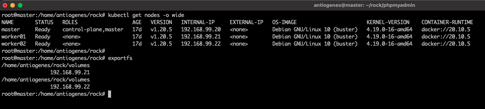

# Rock Stage SRE Assessment

## About Rock Stage

Currently, our product is based on a set of Kubernetes clusters with all websites hosted split on Deployments and Services. Each Deployment has one Pod with 2 init-containers and 3 containers running indefinitely. Those are managed by a custom CRD named WPSite (we won't need any details of it by now).

Here's an overview of what a WordPress website Deployment at Rock Stage looks like: 


## What you should do

- Configure a Kubernetes cluster locally (Minikube is probably the easiest way)

### For this assessment I used a k8s cluster with 1 master node and 2 worker nodes created previously for study purposes, on the master node I installed the NFS-Server service and on the worker nodes the service on the NFS client, shared the /home/antiogenes/rock/volumes to be used as a persistent volume in the cluster.



### Before creating the manifest files of the deployment, service and persistent volumes of the applications and database, I defined the credentials to be used in mysql for the root user and users of the databases to be used for each wordpress deployment, then I converted passwords to base64 and created the manifests for each secret in the secrets directory.

```bash
root@master:/home/antiogenes/rock# echo -n 'LobsterPassRoot' | base64
TG9ic3RlclBhc3NSb290
root@master:/home/antiogenes/rock# echo -n 'LobsterPass01' | base64
TG9ic3RlclBhc3MwMQ==
root@master:/home/antiogenes/rock# echo -n 'LobsterPass02' | base64
TG9ic3RlclBhc3MwMg==
root@master:/home/antiogenes/rock# echo -n 'LobsterPass03' | base64
TG9ic3RlclBhc3MwMw==
root@master:/home/antiogenes/rock# ls secrets/
mysql-secret.yaml  wp-client01-secret.yaml  wp-client02-secret.yaml  wp-client03-secret.yaml
root@master:/home/antiogenes/rock# kubectl create -f secrets/
secret/mysql-root-pass created
secret/mysql-client01-pass created
secret/mysql-client02-pass created
secret/mysql-client03-pass created
root@master:/home/antiogenes/rock# kubectl get secrets
NAME                     TYPE                                  DATA   AGE
antiogenes-token-cnwn8   kubernetes.io/service-account-token   3      10d
default-token-jfvhh      kubernetes.io/service-account-token   3      18d
mysql-client01-pass      Opaque                                1      12s
mysql-client02-pass      Opaque                                1      12s
mysql-client03-pass      Opaque                                1      12s
mysql-root-pass          Opaque                                1      12s
```

- Set 3 or more WordPress Kubernetes Deployments + Services
  - you don't need to follow the architecture presented above - 1 container per WordPress deployment is fine
  - use whatever ports you like (they can be set manually)

### I considered each wordpress deployment as a client and created 3 directories containing the necessary manifests for each one, each wordpress pod connects to the database with its own credentials created during the deployment of mysql.

```bash
root@master:/home/antiogenes/rock# kubectl create -f client01/
deployment.apps/wp-client01-deployment created
persistentvolume/wp-client01-pv created
persistentvolumeclaim/wp-client01-pvc created
service/wordpress-svc-client01 created
root@master:/home/antiogenes/rock# kubectl create -f client02/
deployment.apps/wp-client02-deployment created
persistentvolume/wp-client02-pv created
persistentvolumeclaim/wp-client02-pvc created
service/wordpress-svc-client02 created
root@master:/home/antiogenes/rock# kubectl create -f client03/
deployment.apps/wp-client03-deployment created
persistentvolume/wp-client03-pv created
persistentvolumeclaim/wp-client03-pvc created
service/wordpress-svc-client03 created

```

- Set a MySQL Deployment + Service
  - It should persist data even when the Pod restarts
  - Use this deployment as the WordPress deployments' database (create multiple DBs on it)
    - You'll need separate users and passwords for each deployment
    - You can use whatever way you like to set the MySQL database/user/password to be used on wordpress-container
  - Use whatever way you like to populate the MySQL instance (you can do it with a custom wordpress image on wordpress-container if you like)

## Was created a simple deployment of mysql where the difference is a shell script to create the bases, users and passwords in mysql, script mounted through configmap in the /docker-entrypoint-initdb.d directory of the mysql container where it is executed at startup, the users passwords passed by environment variables created in secret format at the beginning of this assessment.

```bash
root@master:/home/antiogenes/rock# kubectl create -f mysql/
configmap/mysql-configmap created
deployment.apps/wordpress-mysql created
persistentvolume/mysql-pv created
persistentvolumeclaim/mysql-pvc created
service/wordpress-mysql created
```

- Set PHPMyAdmin for sites
  - Every site "owner" should be able to access PHPMyAdmin
  - Use the strategy you want (use your imagination)

## The deployment of phpmyadmin was created, it connects to the mysql database and users can access using the credentials of their own database on mysql.

```bash
root@master:/home/antiogenes/rock# kubectl create -f phpmyadmin/
deployment.apps/phpmyadmin-deployment created
service/phpmyadmin created
```

### Each wordpress and phpmyadmin service can be accessed through the node's IP and its respective port manually configured in the service manifest. 

```bash
root@master:/home/antiogenes/rock# kubectl get service
NAME                     TYPE        CLUSTER-IP       EXTERNAL-IP   PORT(S)        AGE
kubernetes               ClusterIP   10.96.0.1        <none>        443/TCP        18d
phpmyadmin               NodePort    10.101.177.190   <none>        80:32101/TCP   33m
wordpress-mysql          ClusterIP   None             <none>        3306/TCP       36m
wordpress-svc-client01   NodePort    10.107.169.164   <none>        80:32001/TCP   41m
wordpress-svc-client02   NodePort    10.97.213.60     <none>        80:32002/TCP   41m
wordpress-svc-client03   NodePort    10.106.5.114     <none>        80:32003/TCP   40m
```

- Set Prometheus + Grafana monitoring for the MySQL service (Bonus task - not required)

## Considerations

- You may fork this repo to do the assessment
- You can create a Markdown file to document whatever decisions you think that aren't obvious and what we should do to replicate your environment
- You have 7 days to finish the assessment (you can answer the email with the link to your repository)
